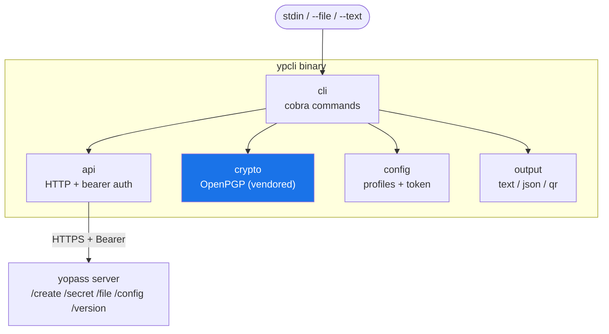
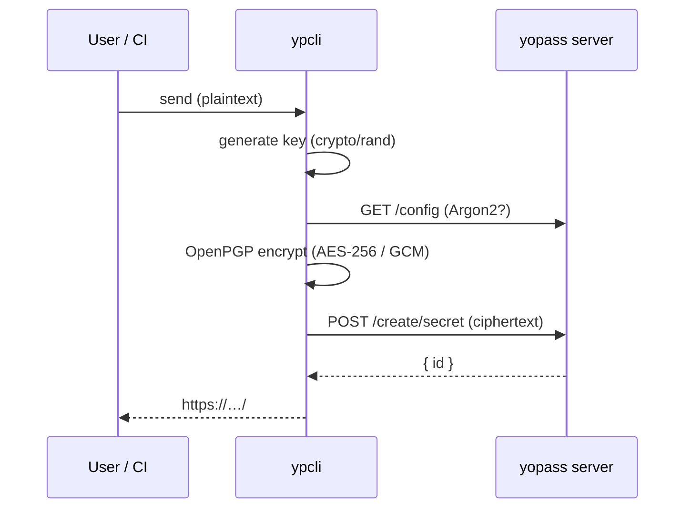

<p align="center">
  <strong>ypcli</strong><br>
  CI / agents / team-first CLI for sharing end-to-end-encrypted one-time secrets via yopass
</p>

<p align="center">
  <a href="https://github.com/dantte-lp/ypcli/actions/workflows/ci.yml"></a>
  <a href="https://github.com/dantte-lp/ypcli/actions/workflows/security.yml"></a>
  <a href="https://codecov.io/gh/dantte-lp/ypcli"></a>
  <a href="https://pkg.go.dev/github.com/dantte-lp/ypcli"></a>
  <a href="https://goreportcard.com/report/github.com/dantte-lp/ypcli"></a>
  <br>
  
  <a href="https://github.com/dantte-lp/ypcli/releases"></a>
  <a href="https://conventionalcommits.org"></a>
  <a href="https://github.com/dantte-lp/ypcli/blob/master/LICENSE"></a>
</p>

---

**ypcli** publishes text and files to a [yopass](https://github.com/jhaals/yopass)
server as **end-to-end-encrypted, self-expiring one-time secrets**. Encryption
happens client-side with OpenPGP — the decryption key never reaches the server.

It is a **CI / agents / team-first** superset of the official yopass CLI:
bearer-token authentication, machine-readable JSON output, strict exit codes,
and multiple server profiles — while staying byte-for-byte interoperable with the
yopass web frontend (openpgp.js v6).

## Why ypcli

- **Works with locked-down instances.** Bearer-token auth (`--token`,
  `YPCLI_TOKEN`, or a per-profile `token_command`) reaches `REQUIRE_AUTH` /
  OIDC-gated servers non-interactively — the official CLI cannot.
- **Built for automation.** `--json` on every command and stable exit codes
  (auth vs not-found vs decrypt failures are distinguishable) make it safe to
  script in CI and agents.
- **Multiple servers, one tool.** Named profiles target different yopass
  instances without repeating `--api/--url`; tokens are sourced from a command,
  never stored in plaintext.
- **Interoperable and minimal.** The crypto is a vendored ~150-line surface over
  `ProtonMail/go-crypto`; interoperability with upstream is proven by a
  **test-only** dependency that never links into the shipped binary.
- **Everywhere.** Static, CGO-free binaries for macOS, Linux, and Windows on
  amd64 and arm64.

## Install

```bash
# Homebrew (macOS)
brew install dantte-lp/tap/ypcli

# Scoop (Windows)
scoop bucket add dantte-lp https://github.com/dantte-lp/scoop-bucket
scoop install ypcli

# Go
go install github.com/dantte-lp/ypcli/cmd/ypcli@latest
```

Prebuilt archives are on the [Releases](https://github.com/dantte-lp/ypcli/releases) page.

## Quick Start

```bash
# Encrypt text from stdin, print a one-time share URL
printf 'my secret' | ypcli send

# Encrypt a file, valid for one day
ypcli send --file ./db.env --expiration 1d

# Receive and decrypt (text to stdout)
ypcli receive 'https://yopass.se/#/s/ID/KEY'

# CI-friendly: machine-readable output
url=$(printf "$PASSWORD" | ypcli send --json --one-time | jq -r .url)
```

## Architecture



The random key never leaves the client — it lives only in the URL fragment
(`#/…`), which browsers never send to the server.



## Documentation

Full documentation lives in [`docs/`](docs/README.md). **English is canonical**;
a Russian mirror is in [`docs/ru/`](docs/ru/README.md).

| # | Document (EN) | RU | Description |
|---|---|---|---|
| 01 | [Architecture](docs/en/01-architecture.md) | [ru](docs/ru/01-architecture.md) | Packages, layers, data flow |
| 02 | [Installation](docs/en/02-installation.md) | [ru](docs/ru/02-installation.md) | Homebrew, Scoop, winget, Go, binaries |
| 03 | [Usage](docs/en/03-usage.md) | [ru](docs/ru/03-usage.md) | send / receive walkthroughs |
| 04 | [CLI Reference](docs/en/04-cli.md) | [ru](docs/ru/04-cli.md) | Every command and flag |
| 05 | [Configuration](docs/en/05-configuration.md) | [ru](docs/ru/05-configuration.md) | Profiles, precedence, tokens |
| 06 | [Automation](docs/en/06-automation.md) | [ru](docs/ru/06-automation.md) | CI/agents, JSON, exit codes |
| 07 | [Security](docs/en/07-security.md) | [ru](docs/ru/07-security.md) | Crypto model, interoperability |
| 08 | [Development](docs/en/08-development.md) | [ru](docs/ru/08-development.md) | Build, test, lint, release |

## Exit codes

| Code | Meaning |
|---|---|
| 0 | success |
| 1 | generic error |
| 2 | usage / bad flags |
| 3 | configuration error |
| 4 | network / timeout |
| 5 | auth failure (401/403) |
| 6 | not found / one-time already consumed (404/410) |
| 7 | decryption / crypto failure |

## Contributing

Repository participation is governed by [CONTRIBUTING.md](CONTRIBUTING.md),
[CODE_OF_CONDUCT.md](CODE_OF_CONDUCT.md), [SECURITY.md](SECURITY.md),
[SUPPORT.md](SUPPORT.md), [GOVERNANCE.md](GOVERNANCE.md), and
[MAINTAINERS.md](MAINTAINERS.md).

```bash
make verify    # build + test (-race) + lint + vuln
```

## License

[MIT](LICENSE) © Pavel Lavrukhin
