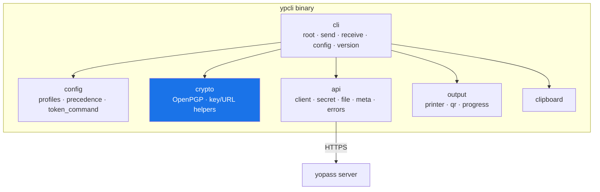
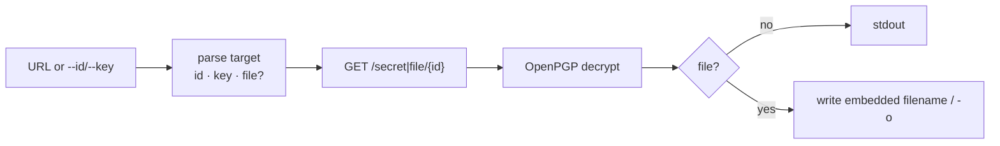
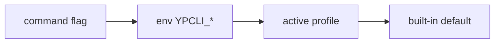

# Architecture

ypcli is a layered Go application. Each `internal/` package has a single
responsibility and a well-defined interface, with no package-global mutable
state.

## Packages

| Package | Responsibility | Key dependencies |
|---|---|---|
| `internal/cli` | cobra command tree, flag/env/profile resolution, exit-code mapping | cobra, viper |
| `internal/api` | context-aware HTTP transport, bearer auth, typed errors | net/http |
| `internal/crypto` | vendored OpenPGP (encrypt/decrypt, keys, URLs) | ProtonMail/go-crypto |
| `internal/config` | YAML profiles, precedence merge, token sourcing | yaml.v3 |
| `internal/output` | text/json printers, terminal QR, download progress | skip2/go-qrcode |
| `internal/clipboard` | cross-platform clipboard (no CGO) | atotto/clipboard |

## Component diagram

## Layering rules

- `cli` orchestrates; it is the only package that reads flags and writes to the
  user's terminal.
- `api`, `crypto`, `config`, `output`, and `clipboard` never import `cli`.
- `crypto` depends on nothing in the project — it is the interoperability
  boundary and stays a pure, minimal surface.

## Send data flow

```mermaid
flowchart LR
    IN["stdin / --file / --text"] --> RES["resolve settings<br/>flag > env > profile > default"]
    RES --> KEY["generate key (crypto/rand)<br/>or --key"]
    KEY --> CFGQ["GET /config<br/>Argon2?"]
    CFGQ --> ENC["OpenPGP encrypt<br/>AES-256 / SHA-256 / GCM"]
    ENC --> POST["POST /create/secret|file"]
    POST --> URL["build share URL<br/>#/{s,f}/{id}/{key}"]
    URL --> EMIT["emit: text | json (+qr, +clipboard)"]
```

## Receive data flow

## Configuration precedence

Every setting resolves in this exact order:

Implemented in `internal/cli/root.go` with a fresh `viper.New()` per command,
where the active profile forms the default layer beneath flags and environment
variables.
