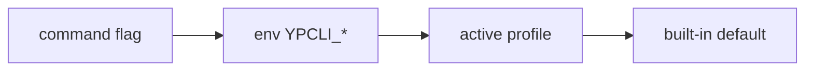

# Configuration

## Precedence

Every setting resolves in this exact order:



For example, `--api` wins over `YPCLI_API`, which wins over the active profile's
`api`, which wins over the public default `https://api.yopass.se`.

## Config file

Profiles are stored in `$XDG_CONFIG_HOME/ypcli/config.yaml` (falling back to
`~/.config/ypcli/config.yaml`), written with mode `0600`.

```yaml
active: work
profiles:
  work:
    api: https://api.yopass.corp
    url: https://yopass.corp
    expiration: 1d
    one_time: true
    argon2: true
    token_command: vault read -field=token secret/yopass
  public:
    api: https://api.yopass.se
    url: https://yopass.se
```

| Field | Meaning |
|---|---|
| `api` | API base URL |
| `url` | public URL used to build share links |
| `expiration` | default lifetime (`1h`/`1d`/`1w`) |
| `one_time` | default one-time behavior |
| `argon2` | force Argon2id on/off (otherwise auto-detected via `/config`) |
| `token_command` | shell command that prints a bearer token to stdout |

Manage profiles with [`ypcli config`](04-cli.md#ypcli-config).

## Tokens

Bearer tokens are resolved at request time and **never persisted** to the config
file:

| Source | Example |
|---|---|
| Flag | `ypcli send --token "$TOK" …` |
| Environment | `YPCLI_TOKEN=… ypcli send …` |
| Profile command | `token_command: vault read -field=token secret/yopass` |

An explicit `--token`/`YPCLI_TOKEN` always wins over `token_command`. The token
is sent as `Authorization: Bearer <token>`.

## Argon2id

When a profile does not set `argon2`, ypcli queries the server `GET /config`
endpoint and enables memory-hard Argon2id key derivation if the server
advertises `ARGON2: true`. Decryption needs no configuration — the S2K type is
stored inside the OpenPGP message.
