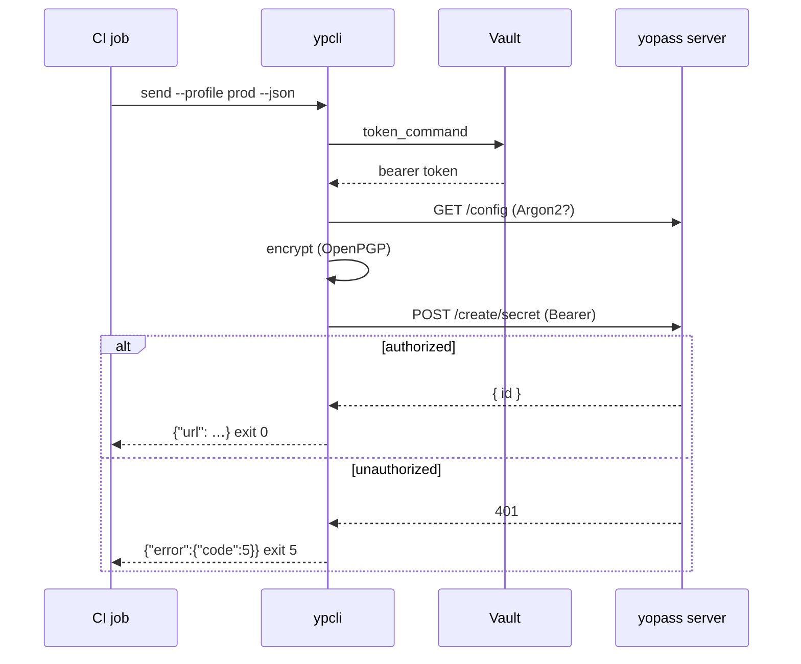

# Automation (CI & agents)

ypcli is designed to run unattended. Two features make it script-safe:
machine-readable output (`--json`) and stable exit codes.

## JSON output

Every command accepts `--json`. Success payloads go to **stdout**; errors go to
**stderr** as `{"error":{"code":…,"message":…}}`.

```bash
url=$(printf "$PASSWORD" | ypcli send --json --one-time | jq -r .url)
echo "share: $url"
```

`send` emits:

```json
{"id":"…","url":"https://…","key":"…","manual_key":false,"file":false,"one_time":true,"expiration":"1h"}
```

## Exit codes

Distinguish failure classes without parsing text:

| Code | Meaning | Typical CI action |
|---|---|---|
| 0 | success | continue |
| 2 | usage / bad flags | fix invocation |
| 3 | configuration error | fix profile/config |
| 4 | network / timeout | retry with backoff |
| 5 | auth failure | refresh token |
| 6 | not found / consumed | secret already used |
| 7 | decryption failure | wrong key |

## Authenticated instances

Source the token from a secrets manager rather than storing it:

```bash
ypcli config add prod \
  --api https://api.yopass.corp \
  --url https://yopass.corp \
  --token-command 'vault read -field=token secret/yopass'

ypcli send --profile prod --file ./service.key --json
```

Or pass it directly in a pipeline:

```bash
YPCLI_TOKEN="$CI_YOPASS_TOKEN" ypcli send --profile prod --text "$SECRET" --json
```

## End-to-end flow



## GitHub Actions example

```yaml
- name: Share deploy key
  env:
    YPCLI_TOKEN: ${{ secrets.YOPASS_TOKEN }}
  run: |
    url=$(ypcli send --api https://api.yopass.corp --url https://yopass.corp \
      --file ./deploy.key --expiration 1d --json | jq -r .url)
    echo "::notice::Secret shared at $url"
```
