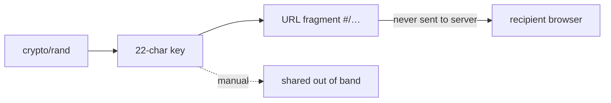

# Security

ypcli performs **client-side** end-to-end encryption. The server stores only
ciphertext and never sees the plaintext or the decryption key.

## Cryptographic model

| Property | Value |
|---|---|
| Scheme | OpenPGP symmetric encryption (`ProtonMail/go-crypto`) |
| Cipher | AES-256 |
| Hash | SHA-256 |
| Compression | none |
| AEAD | GCM |
| Key derivation | iterated SHA-256, or Argon2id when the server advertises it |
| Key generation | `crypto/rand`, 22-char base64url |
| Text encoding | ASCII-armored PGP |
| File encoding | binary PGP with filename embedded in the literal-data packet |

This configuration is **byte-for-byte identical** to the yopass server and the
openpgp.js frontend, so secrets created by ypcli decrypt in the browser and vice
versa.

## Key handling

- The random key lives only in the URL **fragment** (`#/…`). Browsers never
  transmit fragments to the server, so the server cannot decrypt.
- With `--key`, the key is omitted from the URL entirely and delivered out of
  band.

## Authentication

- Bearer tokens come from `--token`, `YPCLI_TOKEN`, or a per-profile
  `token_command`, and are **never written** to the config file.
- The config file is created with mode `0600`.
- Tokens are sent only as `Authorization: Bearer <token>` over the configured
  API URL (use HTTPS).

## Supply chain

- The shipped binary depends only on `ProtonMail/go-crypto` and the CLI
  framework. The upstream `jhaals/yopass` module is a **test-only** dependency
  used to prove interoperability; `go tool nm` confirms zero yopass symbols in
  the release binary.
- `crypto/rand` is the only randomness source; `math/rand` is never used.
- The `unsafe` package is never used.
- `gosec` and `govulncheck` run in CI.

## Reporting

See [SECURITY.md](../../SECURITY.md) for private vulnerability disclosure.
