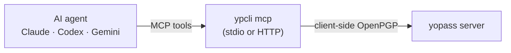

# MCP server & agent integration

`ypcli mcp` runs a [Model Context Protocol](https://modelcontextprotocol.io)
server that exposes ypcli's operations as tools, so AI agents (Claude, Codex,
Gemini, …) can share and fetch secrets. It reuses the same crypto and transport
as the CLI, so behavior is identical. Connection settings come from the ypcli
[config profiles](05-configuration.md) on the host.



## Tools

| Tool | Purpose |
|---|---|
| `send_secret` | encrypt & publish text → one-time share URL |
| `send_file` | encrypt & publish a file (by path) → share URL |
| `receive_secret` | fetch & decrypt a share URL (or `id`+`key`) — consumes one-time secrets |
| `list_profiles` | list configured server profiles |
| `server_version` | client + yopass server version |

Each tool accepts an optional `profile`. `--read-only` omits `receive_secret`
for send-only deployments.

## Local (stdio)

The agent launches `ypcli mcp` as a subprocess. Install ypcli and configure a
profile first (see [Installation](02-installation.md), [Configuration](05-configuration.md)).

**Claude Code**

```bash
claude mcp add ypcli -- ypcli mcp
```

**Codex** — add to `~/.codex/config.toml`:

```toml
[mcp_servers.ypcli]
command = "ypcli"
args = ["mcp"]
```

**Gemini CLI** — add to `~/.gemini/settings.json`:

```json
{ "mcpServers": { "ypcli": { "command": "ypcli", "args": ["mcp"] } } }
```

Ready-made snippets live in [`integrations/`](https://github.com/dantte-lp/ypcli/tree/master/integrations).

## HTTP (shared server)

Run one server that agents reach over the network with a bearer token:

```bash
YPCLI_MCP_TOKEN=$(openssl rand -hex 32) ypcli mcp --http 127.0.0.1:8765
```

A token is **required** in HTTP mode. Put the server behind a TLS reverse proxy
for remote access; deploy it as a hardened systemd service — see
[`deploy/`](https://github.com/dantte-lp/ypcli/tree/master/deploy). Then point a
client at the URL:

```bash
claude mcp add --transport http ypcli https://mcp.yopass.corp \
  --header "Authorization: Bearer $YPCLI_MCP_TOKEN"
```

Codex uses `url` + `bearer_token_env_var`; Gemini uses an `httpUrl` server entry.

## Claude skill

The repo ships a Claude [Agent Skill](https://code.claude.com/docs/en/skills) at
[`skills/ypcli/`](https://github.com/dantte-lp/ypcli/tree/master/skills/ypcli).
Copy it to `~/.claude/skills/ypcli/` so Claude knows when and how to share
secrets with the MCP tools.

## Security

- **`send_file` reads any local file** the caller names (absolute path only). An
  autonomous agent that can be prompt-injected could be steered into exfiltrating
  sensitive files (SSH keys, cloud credentials). Run the MCP server under a
  least-privileged user with a restricted filesystem view — the systemd unit in
  [`deploy/`](https://github.com/dantte-lp/ypcli/tree/master/deploy) uses
  `ProtectSystem=strict`; for stdio/local agents, launch ypcli from a confined
  working directory or omit `send_file` from the client's allowed tools.
- HTTP mode requires a bearer token (constant-time compared); bind to loopback
  behind TLS for anything non-local.
- `receive_secret` **consumes** one-time secrets on first fetch — only call it to
  reveal (and destroy) a secret.
- Plaintext secrets and tokens are never logged. Tokens come from the profile's
  `token_command`, never from disk.
- Use `--read-only` where agents should only publish, never fetch.
