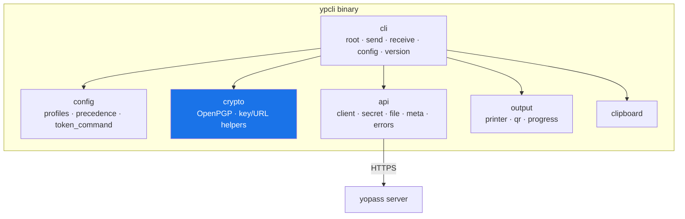
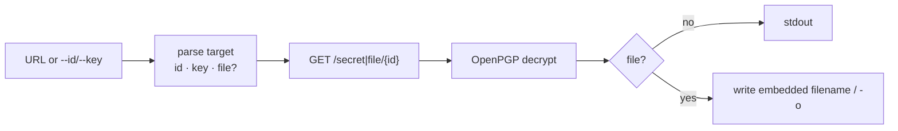
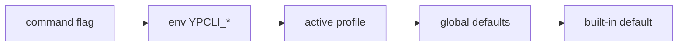

# Архитектура

ypcli — это многослойное приложение на Go. Каждый пакет `internal/` имеет единственную
зону ответственности и чётко определённый интерфейс, без изменяемого состояния,
глобального для пакета.

## Пакеты

| Пакет | Ответственность | Ключевые зависимости |
|---|---|---|
| `internal/cli` | дерево команд cobra, разрешение флагов/env/профилей, сопоставление кодов возврата | cobra, viper |
| `internal/api` | контекстно-зависимый HTTP-транспорт, bearer-аутентификация, типизированные ошибки | net/http |
| `internal/crypto` | встроенный OpenPGP (шифрование/дешифрование, ключи, URL) | ProtonMail/go-crypto |
| `internal/config` | YAML-профили, слияние по приоритету, источники токенов | yaml.v3 |
| `internal/output` | text/json-принтеры, терминальный QR, прогресс загрузки | skip2/go-qrcode |
| `internal/clipboard` | кроссплатформенный буфер обмена (без CGO) | atotto/clipboard |

## Диаграмма компонентов

## Правила слоёв

- `cli` управляет оркестрацией; это единственный пакет, который читает флаги и пишет в
  терминал пользователя.
- `api`, `crypto`, `config`, `output` и `clipboard` никогда не импортируют `cli`.
- `crypto` не зависит ни от чего в проекте — это граница совместимости,
  которая остаётся чистой, минимальной поверхностью.

## Поток данных при отправке

```mermaid
flowchart LR
    IN["stdin / --file / --text"] --> RES["resolve settings<br/>flag > env > profile > default"]
    RES --> KEY["generate key (crypto/rand)<br/>or --key"]
    KEY --> CFGQ["GET /config<br/>Argon2?"]
    CFGQ --> ENC["OpenPGP encrypt<br/>AES-256 / SHA-256 / GCM"]
    ENC --> POST["POST /create/secret|file"]
    POST --> URL["build share URL<br/>#/{s,f}/{id}/{key}"]
    URL --> EMIT["emit: text | json (+qr, +clipboard)"]
```

## Поток данных при получении

## Приоритет конфигурации

Каждый параметр разрешается именно в этом порядке:

Реализовано в `internal/cli/root.go` с созданием нового `viper.New()` для каждой
команды; `config.Effective` накладывает активный профиль поверх глобального блока
`defaults`, формируя слой значений по умолчанию под флагами и переменными окружения.
