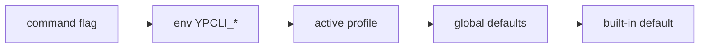

# Конфигурация

## Приоритет

Каждая настройка разрешается ровно в таком порядке:



Например, `--api` имеет приоритет над `YPCLI_API`, который имеет приоритет над
`api` активного профиля, который имеет приоритет над `defaults.api` верхнего
уровня, который имеет приоритет над встроенным публичным значением
`https://api.yopass.se`.

## Файл конфигурации

Профили хранятся в `$XDG_CONFIG_HOME/ypcli/config.yaml` (с запасным вариантом
`~/.config/ypcli/config.yaml`) и записываются с правами `0600`.

```yaml
defaults:                      # global defaults, applied beneath every profile
  api: https://api.yopass.corp
  url: https://yopass.corp
  expiration: 1d
active: work
profiles:
  work:
    argon2: true               # inherits api/url/expiration from defaults
    token_command: vault read -field=token secret/yopass
  public:
    api: https://api.yopass.se
    url: https://yopass.se
```

| Поле | Значение |
|---|---|
| `api` | базовый URL API |
| `url` | публичный URL, используемый для построения ссылок на секреты |
| `expiration` | время жизни по умолчанию (`1h`/`1d`/`1w`) |
| `one_time` | поведение one-time по умолчанию |
| `argon2` | принудительно включить/выключить Argon2id (иначе определяется автоматически через `/config`) |
| `token_command` | shell-команда, выводящая bearer token в stdout |

Управляйте профилями с помощью [`ypcli config`](04-cli.md#ypcli-config).

## Глобальные дефолты

Блок `defaults` верхнего уровня содержит настройки, применяемые под **каждым**
профилем: они заполняют любое поле, не заданное активным профилем (и
флагами/env), до встроенных публичных значений. Это позволяет указать
self-hosted сервер один раз, вообще без профиля:

```bash
ypcli config defaults --api https://api.yopass.corp --url https://yopass.corp
printf 'secret' | ypcli send    # использует глобальные дефолты, без --api
```

`ypcli config defaults` принимает `--api`, `--url`, `--expiration` и
`--token-command`. Профиль переопределяет глобальный дефолт только для полей,
которые он задаёт: профиль, задающий только `url`, всё равно наследует `api` из
`defaults`.

## Токены

Bearer token'ы разрешаются в момент запроса и **никогда не сохраняются** в файл
конфигурации:

| Источник | Пример |
|---|---|
| Флаг | `ypcli send --token "$TOK" …` |
| Окружение | `YPCLI_TOKEN=… ypcli send …` |
| Команда профиля | `token_command: vault read -field=token secret/yopass` |

Явный `--token`/`YPCLI_TOKEN` всегда имеет приоритет над `token_command`. Токен
отправляется как `Authorization: Bearer <token>`.

## Argon2id

Если профиль не задаёт `argon2`, ypcli обращается к серверному эндпоинту
`GET /config` и включает устойчивое к перебору по памяти выведение ключа
Argon2id, если сервер сообщает `ARGON2: true`. Для расшифровки настройка не
нужна — тип S2K хранится внутри сообщения OpenPGP.
