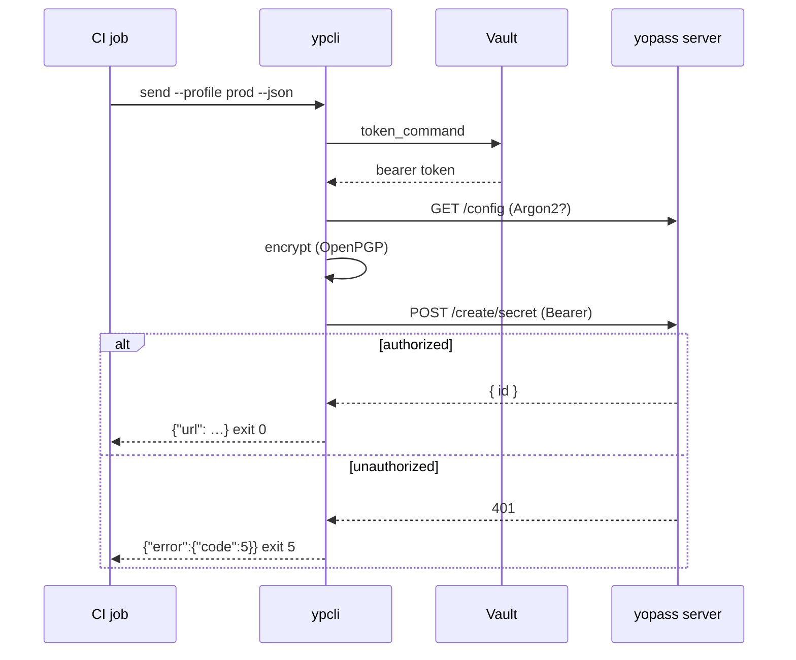

# Автоматизация (CI и агенты)

ypcli спроектирован для работы без участия оператора. Две возможности делают его
безопасным для использования в скриптах: машиночитаемый вывод (`--json`) и
стабильные коды возврата.

## JSON-вывод

Каждая команда принимает `--json`. Данные при успехе идут в **stdout**; ошибки
идут в **stderr** как `{"error":{"code":…,"message":…}}`.

```bash
url=$(printf "$PASSWORD" | ypcli send --json --one-time | jq -r .url)
echo "share: $url"
```

`send` выводит:

```json
{"id":"…","url":"https://…","key":"…","manual_key":false,"file":false,"one_time":true,"expiration":"1h"}
```

## Коды возврата

Различайте классы сбоев без разбора текста:

| Код | Значение | Типичное действие в CI |
|---|---|---|
| 0 | успех | продолжить |
| 2 | использование / неверные флаги | исправить вызов |
| 3 | ошибка конфигурации | исправить профиль/конфигурацию |
| 4 | сеть / таймаут | повторить с задержкой |
| 5 | ошибка аутентификации | обновить токен |
| 6 | не найдено / уже использовано | секрет уже использован |
| 7 | ошибка расшифровки | неверный ключ |

## Инстансы с аутентификацией

Получайте токен из менеджера секретов, а не храните его:

```bash
ypcli config add prod \
  --api https://api.yopass.corp \
  --url https://yopass.corp \
  --token-command 'vault read -field=token secret/yopass'

ypcli send --profile prod --file ./service.key --json
```

Либо передавайте его напрямую в конвейере:

```bash
YPCLI_TOKEN="$CI_YOPASS_TOKEN" ypcli send --profile prod --text "$SECRET" --json
```

## Сквозной поток



## Пример для GitHub Actions

```yaml
- name: Share deploy key
  env:
    YPCLI_TOKEN: ${{ secrets.YOPASS_TOKEN }}
  run: |
    url=$(ypcli send --api https://api.yopass.corp --url https://yopass.corp \
      --file ./deploy.key --expiration 1d --json | jq -r .url)
    echo "::notice::Secret shared at $url"
```
