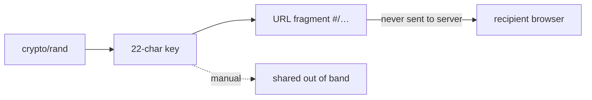

# Безопасность

ypcli выполняет сквозное шифрование **на стороне клиента**. Сервер хранит только
шифротекст и никогда не видит открытый текст или ключ расшифровки.

## Криптографическая модель

| Свойство | Значение |
|---|---|
| Схема | симметричное шифрование OpenPGP (`ProtonMail/go-crypto`) |
| Шифр | AES-256 |
| Хеш | SHA-256 |
| Сжатие | нет |
| AEAD | GCM |
| Выведение ключа | итеративный SHA-256 или Argon2id, когда сервер об этом сообщает |
| Генерация ключа | `crypto/rand`, 22-символьный base64url |
| Кодирование текста | ASCII-armored PGP |
| Кодирование файла | бинарный PGP с именем файла, встроенным в literal-data пакет |

Эта конфигурация **побайтово идентична** серверу yopass и фронтенду на
openpgp.js, поэтому секреты, созданные ypcli, расшифровываются в браузере и
наоборот.

## Обращение с ключами

- Случайный ключ существует только во **фрагменте** URL (`#/…`). Браузеры
  никогда не передают фрагменты на сервер, поэтому сервер не может расшифровать.
- С флагом `--key` ключ полностью исключается из URL и доставляется по
  отдельному каналу.

## Аутентификация

- Bearer token'ы берутся из `--token`, `YPCLI_TOKEN` или из `token_command`
  конкретного профиля и **никогда не записываются** в файл конфигурации.
- Файл конфигурации создаётся с правами `0600`.
- Токены отправляются только как `Authorization: Bearer <token>` по
  настроенному URL API (используйте HTTPS).

## Цепочка поставок

- Поставляемый бинарник зависит только от `ProtonMail/go-crypto` и CLI-фреймворка.
  Вышестоящий модуль `jhaals/yopass` является зависимостью **только для тестов**,
  используемой для доказательства совместимости; `go tool nm` подтверждает
  отсутствие символов yopass в релизном бинарнике.
- `crypto/rand` — единственный источник случайности; `math/rand` не используется
  никогда.
- Пакет `unsafe` не используется никогда.
- `gosec` и `govulncheck` запускаются в CI.

## Сообщение об уязвимостях

См. [SECURITY.md](../../SECURITY.md) для приватного раскрытия уязвимостей.
