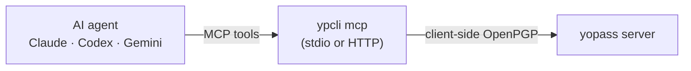

# MCP-сервер и интеграция с агентами

`ypcli mcp` запускает сервер [Model Context Protocol](https://modelcontextprotocol.io),
который экспонирует операции ypcli как инструменты, чтобы ИИ-агенты (Claude,
Codex, Gemini, …) могли делиться секретами и получать их. Он переиспользует ту же
криптографию и транспорт, что и CLI, поэтому поведение идентично. Настройки
подключения берутся из [профилей конфигурации](05-configuration.md) ypcli на
хосте.



## Инструменты

| Инструмент | Назначение |
|---|---|
| `send_secret` | зашифровать и опубликовать текст → one-time share URL |
| `send_file` | зашифровать и опубликовать файл (по пути) → share URL |
| `receive_secret` | получить и расшифровать share URL (или `id`+`key`) — потребляет one-time секреты |
| `list_profiles` | список настроенных профилей серверов |
| `server_version` | версия клиента + сервера yopass |

Каждый инструмент принимает опциональный `profile`. `--read-only` убирает
`receive_secret` для send-only деплоев.

## Локально (stdio)

Агент запускает `ypcli mcp` как подпроцесс. Сначала установите ypcli и настройте
профиль (см. [Установка](02-installation.md), [Конфигурация](05-configuration.md)).

**Claude Code**

```bash
claude mcp add ypcli -- ypcli mcp
```

**Codex** — добавьте в `~/.codex/config.toml`:

```toml
[mcp_servers.ypcli]
command = "ypcli"
args = ["mcp"]
```

**Gemini CLI** — добавьте в `~/.gemini/settings.json`:

```json
{ "mcpServers": { "ypcli": { "command": "ypcli", "args": ["mcp"] } } }
```

Готовые сниппеты — в [`integrations/`](https://github.com/dantte-lp/ypcli/tree/master/integrations).

## HTTP (общий сервер)

Запустите один сервер, к которому агенты подключаются по сети с bearer-токеном:

```bash
YPCLI_MCP_TOKEN=$(openssl rand -hex 32) ypcli mcp --http 127.0.0.1:8765
```

В HTTP-режиме токен **обязателен**. Для удалённого доступа поставьте сервер за
TLS reverse-proxy; разверните его как hardened systemd-сервис — см.
[`deploy/`](https://github.com/dantte-lp/ypcli/tree/master/deploy). Затем укажите
клиенту URL:

```bash
claude mcp add --transport http ypcli https://mcp.yopass.corp \
  --header "Authorization: Bearer $YPCLI_MCP_TOKEN"
```

Codex использует `url` + `bearer_token_env_var`; Gemini — запись сервера с
`httpUrl`.

## Claude skill

Репозиторий поставляет Claude [Agent Skill](https://code.claude.com/docs/en/skills)
в [`skills/ypcli/`](https://github.com/dantte-lp/ypcli/tree/master/skills/ypcli).
Скопируйте её в `~/.claude/skills/ypcli/`, чтобы Claude знал, когда и как делиться
секретами через MCP-инструменты.

## Безопасность

- **`send_file` читает любой локальный файл** по указанному пути (только
  абсолютный). Автономный агент, подверженный prompt-injection, может быть
  склонён к эксфильтрации чувствительных файлов (SSH-ключи, облачные
  credentials). Запускайте MCP-сервер под least-privileged пользователем с
  ограниченным доступом к ФС — systemd-юнит в
  [`deploy/`](https://github.com/dantte-lp/ypcli/tree/master/deploy) использует
  `ProtectSystem=strict`; для stdio/локальных агентов запускайте ypcli из
  ограниченного рабочего каталога или уберите `send_file` из разрешённых
  инструментов клиента.
- HTTP-режим требует bearer-токен (сравнение constant-time); для не-локального
  доступа биндите на loopback за TLS.
- `receive_secret` **потребляет** one-time секреты при первом получении —
  вызывайте только чтобы раскрыть (и уничтожить) секрет.
- Plaintext-секреты и токены никогда не логируются. Токены берутся из
  `token_command` профиля, не с диска.
- Используйте `--read-only`, где агенты должны только публиковать, не получать.
